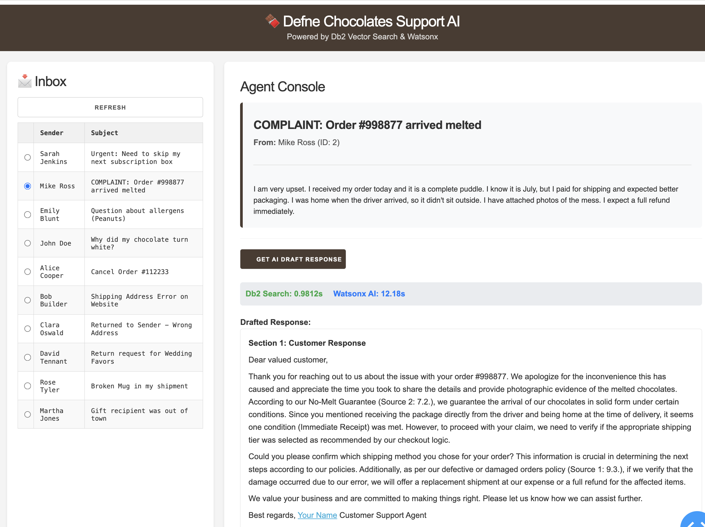
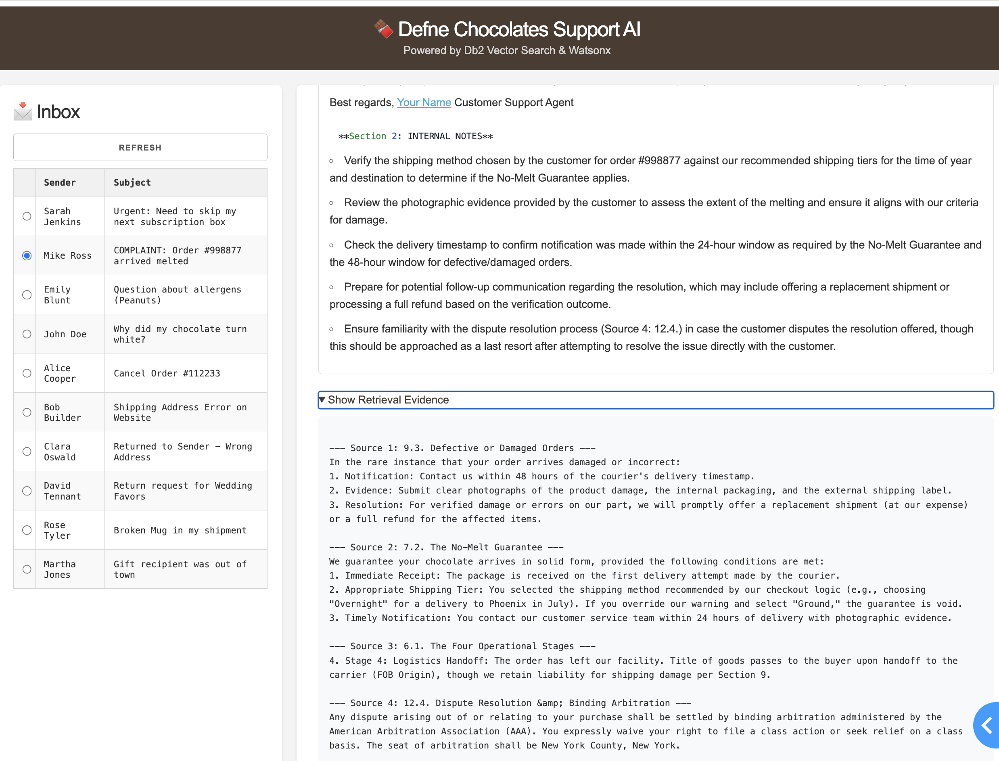

# Building an AI-Powered Customer Support System with Db2 Vector Search, IBM Docling, and watsonx.ai

## Introduction

Db2's native vector capabilities that were initially released in Db2 12.1.2, were the first step towards being able to build AI applications all within Db2. Later in 2025, Db2 continued with this direction with the release of the LLM integration for a technical preview as part of the Db2 Early Access Program. These two features enable application builders to eliminate the points of friction that exist when using dedicated Vector Databases by enabling the complete workflow to be driven directly within Db2. In this blog post, we're going to look at building a Retrieval Augmented Generation (RAG) system leveraging these two features in Db2 12.1, together with IBM Docling for intelligent document processing, and watsonx.ai for embeddings and text generation.

With this goal, we created a fictional use case as the base to showcase the end to end workflow. The problem use case is as follows: the fictional artisan chocolate company, Defne Chocolates (named after my daughter) needs to handle customer support emails efficiently with the help of AI, by referencing their company policies and procedures. What makes this implementation unique is that it eliminates the need for separate vector databases- everything runs in Db2, from transactional data to vector embeddings to AI-powered search. In this use case, all customer emails and company policies were originally stored in Db2, and as you will see, the rest of the workflow that results in the creation of a AI generated response for each customer email is handled directly through Db2.

## Architecture Overview

Our solution consists of four main components:

1. **Document Processing** - Using IBM Docling to convert PDF policies into structured chunks
2. **Vector Database** - Db2 with native vector support for semantic search, including the support of the vector data type (introduced in Db2 12.1.2) and the support of LLM integration directly into SQL (in early preview)
3. **Embedding Generation** - Slate-125M model on watsonx.ai for creating vector embeddings
4. **AI Response Generation** - Llama 3.3 70B on watsonx.ai for generating contextual responses

Let's dive into each step of this workflow.

## Step 1: Document Processing with IBM Docling

The first challenge in any RAG system is converting unstructured documents (like emails and company policies) into searchable chunks. We use **IBM Docling**, an open-source document conversion library developed by IBM Research, to transform PDF policy documents into markdown format, refining chunking and end up with jsonl format.

### IBM Docling

IBM Docling is a powerful document conversion tool that goes beyond simple text extraction:

- **Format Preservation**: Maintains document structure (headers, sections, tables)
- **Multi-format Support**: Handles PDFs, DOCX, and other formats
- **OCR Capabilities**: Extracts text from scanned documents
- **Semantic Structure**: Preserves hierarchical relationships

### Implementation

Simple conversion to MD format with further splitting on the relevant pieces.

```python
from docling.document_converter import DocumentConverter
from langchain_text_splitters import MarkdownHeaderTextSplitter, RecursiveCharacterTextSplitter

# Convert PDF to Markdown
md_content = DocumentConverter().convert(file_path).document.export_to_markdown()

# Split by semantic headers
headers = [("##", "Section"), ("###", "Subsection")]
header_splits = MarkdownHeaderTextSplitter(headers_to_split_on=headers).split_text(md_content)

# Apply size constraints with overlap for context preservation
chunks = RecursiveCharacterTextSplitter(
    chunk_size=1000, 
    chunk_overlap=200
).split_documents(header_splits)
```

## Step 2: Understanding Db2's Native Vector Support

### Db2 for Vector Storage

IBM Db2 12.1.2+ introduces native vector capabilities that fundamentally change how we build AI applications. Instead of maintaining separate vector databases alongside your relational data, Db2 provides a unified platform where vectors are first class citizens.

**The Production Challenge**: Most AI applications start with a vector database for prototyping, then face architectural complexity when moving to production. You need to synchronize data between your operational database and vector store, manage two different backup strategies, and handle consistency across systems. Db2 eliminates this complexity by managing both structured and unstructured data in a single, enterprise-grade platform.

### The VECTOR Data Type

Db2's `VECTOR` data type stores multi-dimensional embeddings as native values. The syntax is straightforward:

```sql
VECTOR(dimensions, coordinate_type)
```

Where:
- **dimensions**: Number of dimensions (e.g., 768 for Slate-125M)
- **coordinate_type**: Data precision (FLOAT32, FLOAT64, INT8, etc.)

### Schema Design for Our Use Case

```sql
CREATE TABLE TEST.DEFNE_POLICY (
    ID INT NOT NULL GENERATED ALWAYS AS IDENTITY,
    CONTENT VARCHAR(3000),
    SECTION_NAME VARCHAR(255),
    SUBSECTION_NAME VARCHAR(255),
    EMBEDDING VECTOR(768, FLOAT32),
    PRIMARY KEY (ID)
);
```

Key design decisions:
- **VECTOR(768, FLOAT32)**: Matches Slate-125M's output dimensions with 32-bit precision
- **GENERATED ALWAYS AS IDENTITY**: Auto-incrementing IDs for easy reference
- **VARCHAR for content**: Stores the original text alongside its embedding
- **Metadata columns**: Section names enable hybrid queries combining semantic and structured filters – just in case we would like to come up with more complex vector search with standard SQL filters.

### Customer Email Table

```sql
CREATE TABLE TEST.CUSTOMER_EMAILS (
    EMAIL_ID INT NOT NULL GENERATED ALWAYS AS IDENTITY,
    SENDER_NAME VARCHAR(100),
    SUBJECT_LINE VARCHAR(255),
    EMAIL_BODY VARCHAR(10000),
    EMBEDDING VECTOR(768, FLOAT32),
    PRIMARY KEY (EMAIL_ID)
);
```

This table stores incoming customer emails along with their vector embeddings, enabling semantic search across both policy documents and email history.

### Understanding Embeddings

Embeddings are numerical representations of text (or other data) in high-dimensional space. Similar concepts cluster together, enabling semantic search that understands meaning rather than just matching keywords.

For example:
- "chocolate melted" and "product arrived liquified" have similar embeddings
- "cancel order" and "stop shipment" cluster together
- "peanut allergy" and "nut sensitivity" are semantically close

Our 768-dimensional vectors capture these semantic relationships. Each dimension represents learned features from the embedding model's training, creating a mathematical space where semantic similarity translates to geometric proximity.

**768 dimensions**: This is the output size of the Slate-125M model. Different models produce different dimensions, and the dimension count balances expressiveness (capturing nuanced meanings) with computational efficiency (storage and search speed).

## Step 3: Generating Embeddings with watsonx.ai

One of Db2's recent features in early preview as part of Db2's Early Access Program is the ability to call external AI models directly from SQL. We configure watsonx.ai's Slate-125M embedding model as an external model:

```sql
CREATE EXTERNAL MODEL slate125m 
PROVIDER WATSONX KEY 'YOUR_API_KEY' 
ID 'ibm/slate-125m-english-rtrvr-v2' 
TYPE TEXT_EMBEDDING RETURNING VECTOR(768, FLOAT32) 
URL 'https://us-south.ml.cloud.ibm.com/ml/v1/text/embeddings?version=2023-10-25' 
PROJECT_ID 'YOUR_PROJECT_ID';
```

### Embedding Generation

With the external model configured, generating embeddings is as simple as:

```sql
-- Generate embeddings for policy documents
UPDATE TEST.DEFNE_POLICY 
SET EMBEDDING = TO_EMBEDDING(CONTENT USING SLATE125M)
WHERE EMBEDDING IS NULL;

-- Generate embeddings for customer emails
UPDATE TEST.CUSTOMER_EMAILS 
SET EMBEDDING = TO_EMBEDDING(SUBJECT_LINE || '. ' || EMAIL_BODY USING SLATE125M)
WHERE EMBEDDING IS NULL;
```

Db2 automatically batches these requests to watsonx.ai, handling authentication and error management seamlessly.

## Step 4: Vector Search for RAG

The core of our RAG system is semantic similarity search using Db2's built-in vector functions. When the customer support agent clicks generate AI response, we:

1. Retrieve the email's embedding
2. Find the most similar policy chunks using cosine similarity
3. Return the top-K most relevant documents

```sql
SELECT P.SECTION_NAME, P.SUBSECTION_NAME, P.CONTENT,
       VECTOR_DISTANCE(E.EMBEDDING, P.EMBEDDING, COSINE) as SCORE
FROM TEST.DEFNE_POLICY P, TEST.CUSTOMER_EMAILS E
WHERE E.EMAIL_ID = ?
ORDER BY SCORE ASC
FETCH FIRST 4 ROWS ONLY
```

`VECTOR_DISTANCE(vec1, vec2, COSINE)` returns a cosine distance value where 0 means identical vectors and larger numbers mean less semantic similarity.

Cosine distance is direction based, ignoring vector magnitude, which makes it effective for comparing text embeddings.

IBM's SLATE-125M embeddings are trained to optimize cosine similarity, so cosine distance is the recommended metric for comparing them in Db2.

### Hybrid Queries: Combining Vector and Structured Search

We could also easily combine vector similarity with traditional SQL predicates in a single query:

```sql
-- Find similar policies, but only from specific sections
SELECT P.SECTION_NAME, P.CONTENT,
       VECTOR_DISTANCE(E.EMBEDDING, P.EMBEDDING, COSINE) as SCORE
FROM TEST.DEFNE_POLICY P, TEST.CUSTOMER_EMAILS E
WHERE E.EMAIL_ID = ?
  AND P.SECTION_NAME IN ('Shipping', 'Returns', 'Refunds')
ORDER BY SCORE ASC
FETCH FIRST 4 ROWS ONLY;
```

This eliminates the need for application-level joins between vector databases and relational databases - a common pain point in traditional RAG architectures. Db2's query optimizer can push predicates down, improving performance for hybrid queries.

## Step 5: AI Response Generation with watsonx.ai

With relevant context retrieved, we use our model on watsonx.ai to generate professional customer responses.

### Prompt Engineering

```python
system_prompt = f"""You are a professional customer support agent for Defne Chocolates.

Your task is to draft a response to the customer inquiry below using ONLY the information provided in the policy documents.

Structure your response in TWO sections:

1. A well-formatted, professional, and courteous reply addressing the customer's concerns. Reference specific policies where applicable and maintain a helpful, empathetic tone.

2. INTERNAL NOTES: Bullet points highlighting key actions for the human support agent, including policy references, verification steps, and any follow-up required.

POLICY DOCUMENTS:
{context_str}

CUSTOMER EMAIL:
{full_email_text}

RESPONSE:
"""
```

## Step 6: Building the User Interface

We built a simple web application that provides customer support agents with an interface to generate AI assisted responses along with internal guidelines:



*AI Drafted Response for the complaint, by semantically matching the policy document and generating a grounded response for the customer.*

### Use Case



*AI Drafted internal guidelines and references to the policy.*

**Scenario:**

When a customer emails about a melted chocolate delivery:

**Customer Email:**
> "I received my order today and it is a complete puddle. I know it is July, but I paid for shipping and expected better packaging..."

**Vector Search Results:**
- Shipping & Handling Policy (Score: 0.12)
- Temperature-Sensitive Products (Score: 0.15)
- Refund & Replacement Policy (Score: 0.18)

**AI-Generated Response:**
> "Dear Mike, We sincerely apologize for the condition of your order. We understand your frustration... According to our policy, we offer full refunds or replacements for temperature-damaged products..."

**Internal Notes:**
- Check shipping date and weather conditions
- Verify packaging used (should be insulated for summer)
- Process refund immediately per policy section 4.2

## Db2 Vector Capabilities

### SQL Routine Vector Support (Db2 12.1.3+)

Db2 has the ability to use VECTOR data types in user-defined functions and stored procedures. This lets you encapsulate AI logic at the database layer where your data lives.

Instead of fetching vectors to your application, processing them, and sending results back, you write the logic once in SQL and execute it where the data resides.

Example use cases:

**1. Custom Similarity Functions**
```sql
CREATE FUNCTION is_similar(
    vec1 VECTOR(768, FLOAT32),
    vec2 VECTOR(768, FLOAT32),
    threshold DOUBLE
) RETURNS INTEGER
BEGIN
    IF VECTOR_DISTANCE(vec1, vec2, COSINE) < threshold THEN
        RETURN 1;
    ELSE
        RETURN 0;
    END IF;
END;
```

**2. Batch Vector Processing**
```sql
CREATE PROCEDURE mark_normalized_embeddings()
BEGIN
    -- Get the magnitude of each vector and mark if normalized
    UPDATE embeddings_table
    SET is_normalized = CASE 
        WHEN ABS(VECTOR_NORM(embedding, EUCLIDEAN) - 1.0) < 0.01 THEN 1
        ELSE 0
    END;
END;
```

## Conclusion

This implementation demonstrates how modern AI capabilities can be seamlessly integrated into enterprise databases without architectural compromises. By combining:

- **IBM Docling** for intelligent document processing
- **Db2 Native Vector Support** for unified data management
- **Db2 LLM Integration** for direct LLM access from SQL (Early Preview)
- **watsonx.ai** for embeddings and generation
- **LangChain/LlamaIndex** for developer-friendly APIs

You don't need complex microservices architectures or specialized vector databases to build powerful RAG systems. Db2 12.1.3+ provides everything you need:

- Native VECTOR data type for storing embeddings
- SQL routine support for custom AI logic
- External model integration for embedding generation (Early Preview)
- Enterprise-grade data movement utilities
- LangChain and LlamaIndex integration

Your vector embeddings work alongside structured data within the same database platform, eliminating data silos and synchronization complexity. Your RAG application doesn't need a rewrite when it moves from development to production.

Db2 provides vector search at scale using the frameworks where developers build AI applications. Your embeddings live where your data lives. Your AI logic lives where your business logic lives. Your operations stay simple.

## Getting Started

### Prerequisites

- **Db2 12.1.2+** for basic vector support, or **latest Db2 12.1 Early Access Program (EAP)** for full SQL routine and data movement capabilities
- **watsonx.ai account** with API credentials
- **Python 3.8+**

### Installation

1. **Clone the repository**
   ```bash
   git clone <repository-url>
   cd db2_blog
   ```

2. **Install Python dependencies**
   ```bash
   pip install -r requirements.txt
   ```

3. **Configure environment variables**
   ```bash
   cp env.sample .env
   # Edit .env with your actual credentials
   ```

4. **Set up Db2 tables and external model**
   ```bash
   db2 -tvf 0_db2_setup.sql
   ```
   **Important**: Edit `0_db2_setup.sql` first to replace `YOUR_WXAI_APIKEY` and `YOUR_PROJECTID` with your actual values.

5. **Process the policy document**
   ```bash
   python3 1_process_document.py defne_chocolates.pdf
   ```

6. **Ingest chunks into Db2**
   ```bash
   python3 2_ingest_chunks.py defne_chocolates.jsonl
   ```

7. **Generate embeddings**
   ```bash
   db2 -tvf 3_generate_embeddings.sql
   ```

8. **Run the dashboard**
   ```bash
   python3 dashboard_app.py
   ```
   Access the application at `http://localhost:8050`

### Quick Start Guide

See [steps.md](steps.md) for detailed execution logs and expected output at each step.

### Resources

- [Db2 Vector Documentation](https://www.ibm.com/docs/en/db2/12.1.x?topic=list-vector-values)
- [Db2 LangChain Integration](https://github.com/IBM/langchain-ibm)
- [Db2 LlamaIndex Tutorial](https://github.com/IBM/llama-index-db2)
- [watsonx.ai Documentation](https://www.ibm.com/docs/en/watsonx-as-a-service)
- [IBM Docling](https://github.com/DS4SD/docling)

### Previous Blogs on the Db2 AI Capabilities:

- [AI Vectors and Similarity Search - A Gentle Introduction](https://community.ibm.com/community/user/blogs/shaikh-quader/2025/03/19/vectors-intro)
- [Bring AI-Powered Search to Your Db2 Data with Vectors](https://community.ibm.com/community/user/blogs/shaikh-quader/2025/04/15/beyond-sql-vector-search)
- [Db2 12.1.x EAP: Call Language Models Directly from SQL](https://community.ibm.com/community/user/blogs/shaikh-quader/2025/11/04/db2-eap-llm-integration)
- [Db2 12.1.3 Vector Features for AI Builders: From the Engineers Who Built Them](https://community.ibm.com/community/user/blogs/shaikh-quader/2025/11/18/db2-12113-vector-features-for-ai-builders)
- [Vector Indexes in Db2 – An early preview](https://community.ibm.com/community/user/blogs/christian-garcia-arellano/2025/10/04/vector-indexes-in-db2-an-early-preview)

---

**About the Author**: Ilker Ender is a Senior Engineer at IBM Ireland with a background in Db2. He leads the agentic AI evaluation work for the Db2 AI Assistant project. Previously, he drove the development of Conversational Search for the Db2 DBA Assistant and managed QA for Big SQL and Data Virtualization. He also holds several patents and has presented his work at IBM Think conferences.

**Technologies Used**: IBM Db2 12.1.2+, watsonx.ai, IBM Docling, Python, Dash, LangChain
